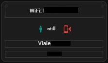

<h2><strong>🧑🏻 Person card for home assistant</strong></h2>

CARD con SWIPE laterale e nel mio caso con 3 viste:

Volevo condividere una scheda che ho creato con l'aiuto delle varie community per visualizzare le informazioni di una persona tramite l'utilizzo dell'app HA companion.

Istruzioni:

da Hacs, installare:
1. swipe-card
2. stack-in-card
3. mushroom

poi ...
1. nel file sensor.yaml, inserire il contenuto di sensor.yaml, se non si dispone del file:
    - è necessario creare sensor.yaml nella cartella config/
    - aprire il file configuration.yaml e inserire questa riga: sensor: !include sensor.yaml
    - all'interno del codice, dovete andare a sostituire tutti i miei sensori chiamati "simone", con i vostri appena abilitati
2. Installare nel menù impostatione - dispositivi e servizi: l'integrazione prossimità
3. sul vostro smartphone installare l'app Home Assistant companion
4. dall'app andate in impostazioni, app complementare, gestione sensori
5. abilitate tutti i sensori che servono e che trovare nei vari file di configurazioni: sensori di rete,sensori ultimo riavvio, sensori di prossimità, sensori batteria, sensori di archiviazione, sensori di attività, sensori di posizione.
6. in HA create una card manuale e incollate il contenuto del file: person_card.yaml
7. copiate il contenuto del file script.txt e create uno script in home assistant e incollare il testo, rinominate "simone" con il nome del vostro device

<strong>Alla fine ci troveremo ad avere:</strong> 
<strong>1. Prima schermata (in ordine dall'alto e da sinistra a destra):</strong>
1. Persona con simbolo se è in casa o no, e testo con dichiarata la zona dove si trova (in base alle zone impostate in HA)
2. % batteria con cambio colore in base al livello, presa di corrente per capire se è sottocarica o no, % memoria libera interna dello smartphone, tipo di rete (se è wifi o 5G)
3. a sinistra: ultimo aggionamento effetuato, a destra: la distanza che la persona si trova da casa

<strong>2. Seconda schermata:</strong>
1. router al quale si è connessi
2. se siamo fermi o in movimento, simbolo del telefono rosso, se lo si clicka attiva lo script: find phone, farà suonare il vostro telefono per trovarlo in caso di smarrimaneto.
3. indirizzo in cui ci si trova nel momento dell'ultima rilevazione
4. numero civico in cui ci si trova nel momento dell'ultima rilevazione

<strong>3. Terza schermata:</strong>
1. è solo un titolo: other info:
2. IP esterno della reta (non ip di casa se siamo in wifi)
3. ultimo riavvio dello smartphone

Risultato finale:

Enjoy!

----------------------------------------

Would you like to give me a hand? The content of this page is completely free of charge and the purpose is certainly not to make money. If you would like to lend me a hand to help with expenses and lost time, you have the following ways:

Make your Amazon purchases from this link:

Join our Telegram channel dedicated to Home Assistant news:

Join our Telegram channel dedicated to home automation products, there are lots of offers:

